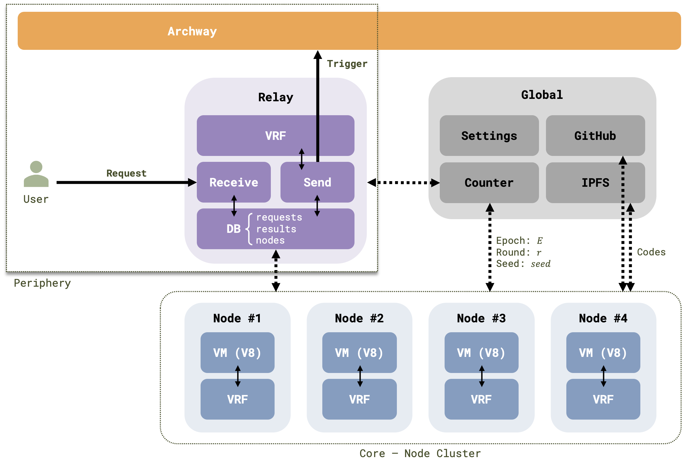

# Multi Node

## Overview

Our Gateway system now boasts enhanced robustness and decentralization, thanks to the multi-node architecture.
This evolution not only improves system resilience but also optimizes performance.

This revised architecture seamlessly integrates the Gateway Bot within the Backend, allowing nodes to focus exclusively on backend tasks, thus streamlining operations.

1. [Archway Smart Contract](https://github.com/D3LAB-DAO/gateway-contract)
2. [Gateway Backend](https://github.com/D3LAB-DAO/gateway-backend)

## Archway Smart Contract

The Archway Smart Contract is responsible for managing web2 actions, project registration, and execution result storage.
It interacts with the Archway blockchain and processes transactions related to the Gateway.

## Gateway Backend

The Gateway Backend is a cluster of Node.js-based microservices, each providing an API endpoint to handle requests and execute specific services.

Users interact with the system through the `Relay` service, which acts as a reverse proxy.

### Global

The `Global` component acts as the centralized configuration manager, ensuring synchronization and harmony throughout the architecture. It consists of:

- **Settings**: This service oversees the system configuration, maintaining consistency and standardization in operations.

- **Counter**: This vital microservice tracks temporal aspects like rounds and epochs, alongside random seed data to keep operations synchronized. It's essential for coordinating tasks that are time-sensitive and for preserving a uniform state throughout the system's lifecycle. Future plans include migrating this service to a decentralized smart contract to further bolster the system's integrity and stability.

- **IPFS and GitHub**: These platforms are used for open-source code storage with version control. A private code storage solution is in the pipeline to offer enhanced privacy for users.

### Relay

The Relay serves as the pivotal communication hub of the architecture, orchestrating the interaction between user requests and the system's processing nodes.

- **Receive**: This microservice is the initial point of contact for user requests. It is tasked with receiving, validating, and queiring incoming data for processing.

- **Send**: Once a request has been processed, this microservice is responsible for dispatching transactions for execution. This script manages a queue of results that have achieved consensus and prepares them for publication.

- **Verifiable Random Function (VRF)**: A `VRF` is employed within `send` to ensure the integrity and randomness of operations. It is used to verify the sortition of nodes. The use of VRF, along with the quorum and consensus mechanisms, contributes significantly to the Relay's ability to balance load across the system and enhance security. These features ensure that no single node or small group of nodes can dominate or disrupt the process, promoting a fair and decentralized environment.

- **Database (DB)**: The `DB` is essential for systematically storing and managing requests. It houses key tables: requests, nodes, and results. Further information on the database structure is detailed in the [tables section](../for-developers/tables).

### Node

Nodes within this architecture are individual units responsible for executing user-requested services. Each node is fortified with a Virtual Machine (`VM`) and `VRF` to perform and secure operations.

- **VM (V8)**: Nodes are powered by Google's V8 engine, a high-performance VM designed to run JavaScript with efficiency. In this Gateway Backend, each Node operates as a dedicated microservice environment, executing code snippets as requested.

- **Verifiable Random Function (VRF)**: It is integral to the system's sharding mechanism, which distributes the execution of code across different Nodes. The use of VRF guarantees that each execution shard is assigned in a manner that is both random and secure, ensuring no single point of failure and upholding the decentralized ethos of the network.
