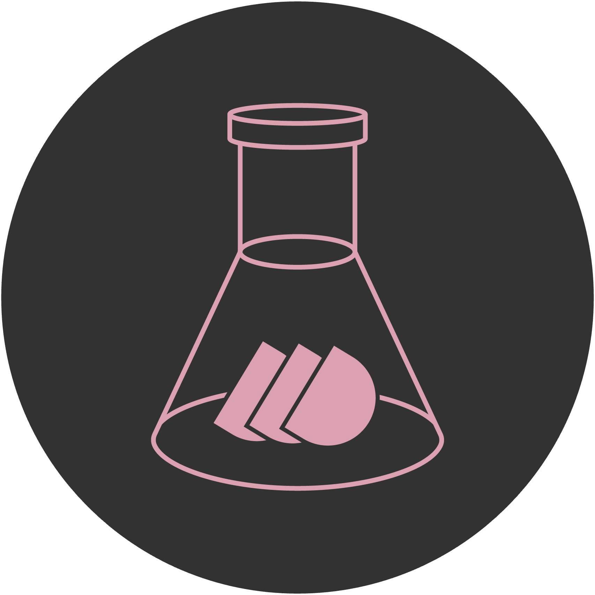

# Who We Are

D3LAB is a decentralized autonomous organization (DAO) dedicated to studying decentralized technologies in a decentralized manner. It was founded to address the issue of numerous blockchain projects containing centralized features for profit-seeking and convenience.

It is noteworthy that Archway and D3LAB share a common focus on developing and nurturing decentralized technologies, applications, and protocols. Both organizations are passionate about contributing to the broader Web 3.0 ecosystem and advocating for a more open, collaborative, and decentralized internet.

---

[💌 d3lab.dao@gmail.com](mailto:d3lab.dao@gmail.com)

[🏠 Homepage](http://d3lab.xyz)

[💻 GitHub](https://github.com/D3LAB-DAO)

[🎥 Youtube](https://www.youtube.com/c/d3lab)
