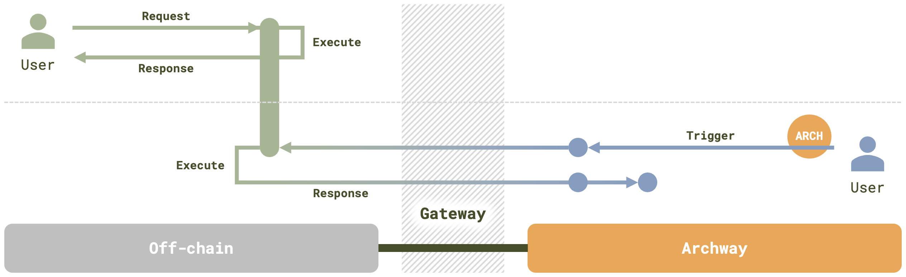

# Features

Gateway provides an extensive set of features that streamline the rewarding process for web2 actions, as well as enable the execution and validation of deterministic code within the Archway ecosystem. Key features include:

- **Archway-compatible rewards for web2 apps and developers**: By utilizing Gateway, web2 apps and developers can be rewarded based on the volume of triggering transactions in an Archway-compatible manner. Gateway allows Archway to reward both web2 and web3 app developers, fostering a more inclusive ecosystem and accelerating the positive feedback loop.
- **Decentralized execution and validation**: Gateway enables the execution and validation of deterministic JavaScript codes (or codes written in any language) triggered by on-chain transactions without compromising web3 decentralization principles. This ensures that web2 logic represented by JavaScript codes can be executed and validated in a decentralized manner.
- **Integration of web2 applications and components**: Gateway allows web2 applications and components, such as AI, databases, and games, to be integrated into Archway, with their usage being rewarded by the platform.
- **ARCH as a universal asset**: With Gateway, ARCH becomes a universal common asset for all web2, web3, and hybrid applications, further solidifying its position within the broader digital landscape.
