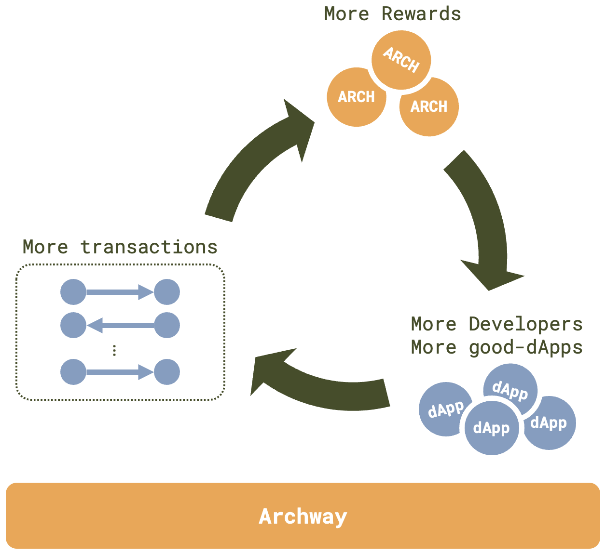

# Archway

Rewards play a crucial and distinctive role within the Archway ecosystem, particularly for dApp developers. By incentivizing positive actions on web3, Archway can fuel a virtuous cycle: greater rewards lead to increased developer participation, the creation of high-quality dApps, a higher volume of web3 actions (transactions), and even more rewards. This process not only promotes financial decentralization but also ensures equal opportunities for developers worldwide.

However, Archway's reward system is limited to web3 actions represented by transactions on its platform. While the Inter-Blockchain Communication (IBC) protocol of Cosmos allows rewards to be distributed across other Cosmos-based blockchains, it does not extend to web2 actions.

Although web3 envisions a fully decentralized and automated digital world, web2 is occasionally better suited for providing certain services, such as AI-based apps. This is because web3 can lead to inefficient use of computing power and network bandwidth.
