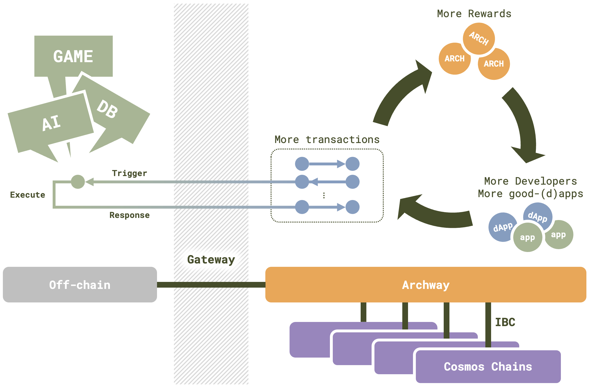

# Gateway

To bridge this gap, we introduce **Gateway**—a service on Archway that rewards web2 actions. Picture a scenario where each node runs the same deterministic JavaScript code, triggered by a transaction, with the results uploaded simultaneously to the blockchain and validated by a smart contract. In this context, the web2 logic represented by JavaScript code is executed and validated without undermining the principles of web3 decentralization.

Gateway empowers us to reward web2 apps and developers based on the volume of triggering transactions in a manner compatible with Archway, fostering a more inclusive and interconnected ecosystem.
