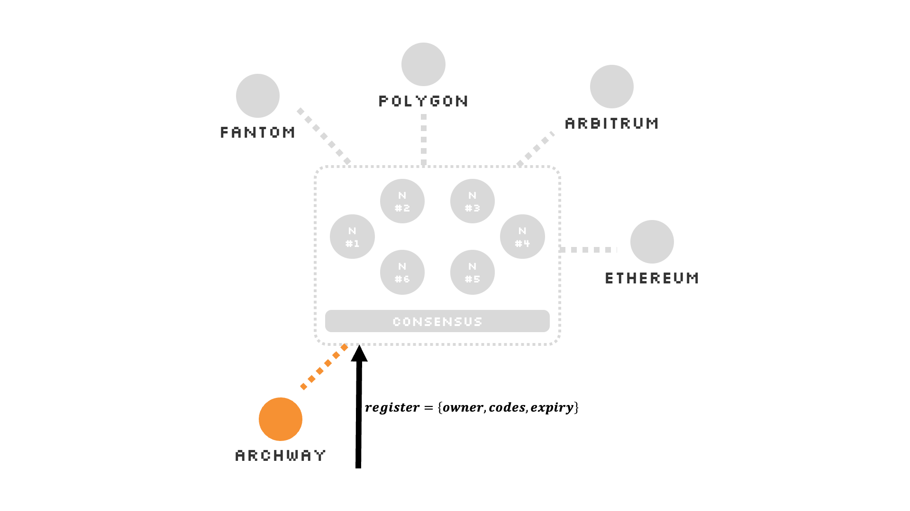
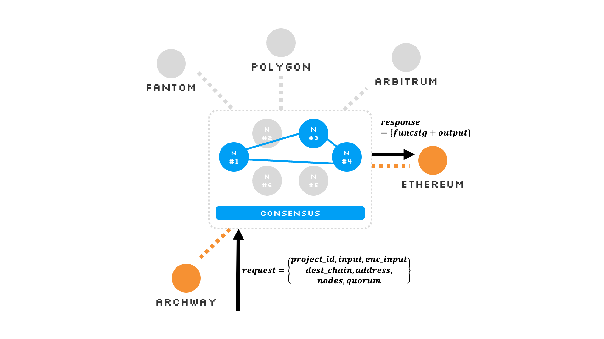

# Multichain Features

Gateway stands out with its multichain capabilities.
Actions initiated on one chain can find their responses on another.
We've crafted Gateway versions compatible with both **EVM-based** blockchains and **CosmWasm-based** blockchains.

The process is as follows:

1. **Register**: Begin by registering your web2 code. Ensure it's written in JavaScript.
2. **Request**: Initiate a call to execute your web2 code, specifying the desired function and providing input parameters.
3. **Response**: After executing the web2 code, each node derives a result. This result undergoes a consensus process among a subset of nodes to ensure its accuracy and reliability. Upon achieving consensus, the validated result is uploaded directly to the target chain, triggering a specific function call on the designated contract.

By following these steps, developers can ensure a seamless integration of their web2 applications within the web3 environment provided by Gateway.

