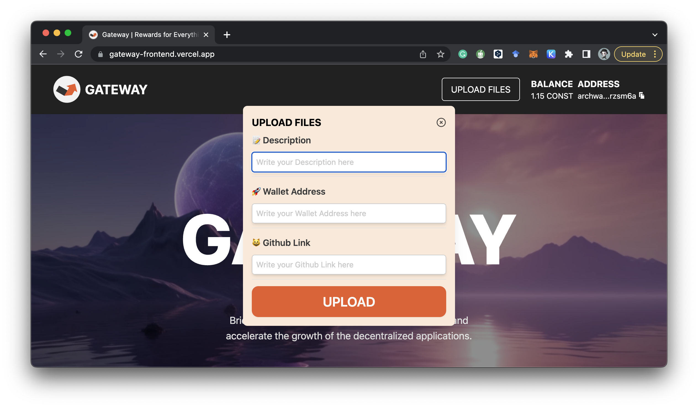
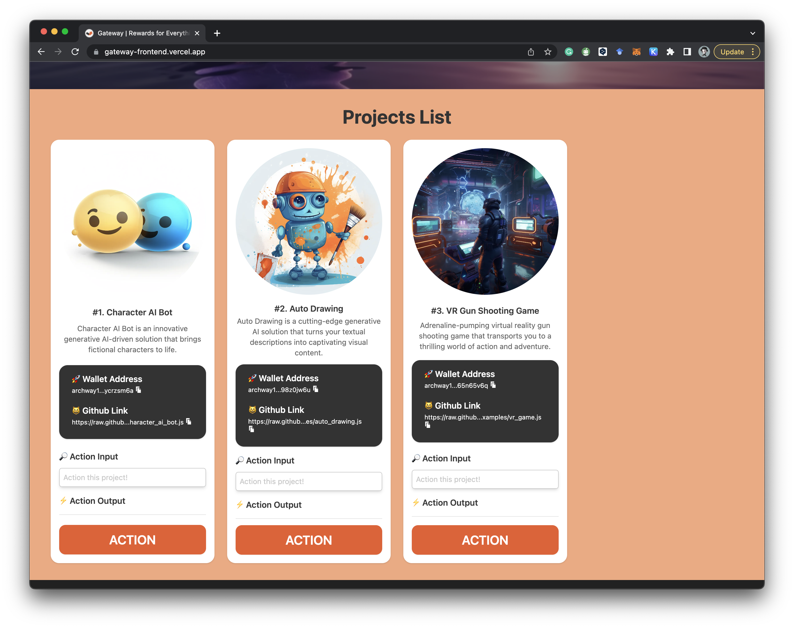

# Usage Guide

Demo Webpage: [https://gateway-frontend.vercel.app/](https://gateway-frontend.vercel.app/)

:::caution
On the demo webpage, you can register a new project by interacting with the contract in Archway.
:::

:::caution
After registration, you can interact with that project through the UI, but for a smooth demo, the newly registered project will disappear from the UI after refreshing.
:::

:::caution
A [backend](https://github.com/D3LAB-DAO/gateway-backend) and [bot](https://github.com/D3LAB-DAO/gateway-bot) are required to run the JavaScript code and register the results on Web2.
:::

---

You must have [Keplr](https://chrome.google.com/webstore/detail/keplr/dmkamcknogkgcdfhhbddcghachkejeap) installed to use the demo webpage.

## **Adding a New Project and Request**

Register a new project by interacting with the Archway Smart Contract. Submit a request with a short description and the URL of the JavaScript code to be executed.

- `Description`: A short description of the project.
- `Wallet address`: Additional information for rewards, etc.
- `GitHub link`: Publicly accessible location of the JavaScript code. This should be a [link to the raw source code only](https://raw.githubusercontent.com/D3LAB-DAO/gateway-backend/main/examples/circle_area.js).

## **Monitoring and Executing Requests**

The Gateway Bot continuously monitors the Archway Smart Contract for new requests. Upon detecting a request, it triggers the Gateway Backend to download and execute the JavaScript code with the provided input parameters.

## **Fetching Execution Results**

The Gateway Bot fetches execution results from the Gateway Backend and stores them in the Archway Smart Contract. Users can retrieve these results by querying the smart contract.
